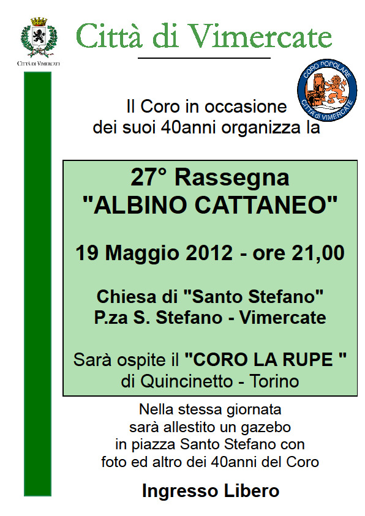
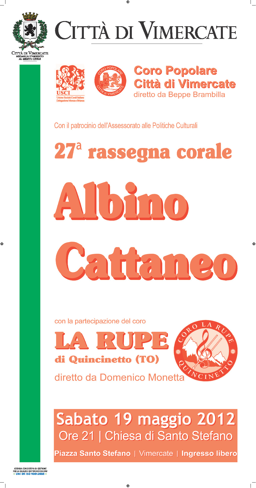

[Archivio eventi passati](..)

# 2012

### 16 dicembre

16.00

Concerto di Natale organizzato dal coro La Miniera di Sesto S. G. Si terrà a Sesto S. G. nella chiesa Nostra Signora di Lourdes in via Tevere (quartiere Pelucca)

### 02 dicembre

21.00

Lissone, nell'ambito della rassegna organizzata da USCI Brianza in occasione del Natale

### 19-20-21 ottobre

Chiesa di Kuchl e Duomo di Salisburgo (Austria)

Concerto la sera del 20 nella Chiesa di Kuchl ed il mattino del 21 accompagneremo la Santa Messa delle ore 11,30 nel Duomo di Salisburgo.

Duomo di Salisburgo - giorno 21 ottobre

### 29 settembre

21,00

Chiesa Parrocchiale di Burago

Rassegna corale con la partecipazione dei cori :

Coro Popolare Città di Vimercate

Little Shinin' Gospel Choir

La serata è organizzata dalla locale sezione CAI.

### 8 luglio

21,00

Bienate fraz. di Magnago (MI) presso il Chiostro Diurno Anziani

18° Rassegna SUONI E VOCI IN CORTE con la partecipazione del Coro L'Estro Armonico e del Gruppo Cohere.

### 19 maggio

21.00

Chiesa di Santo Stefano in Vimercate

27° Rassegna "Albino Cattaneo" con la partecipazione del Coro La Rupe di Quincinetto <www.larupe.it> , in occasione della rassegna festeggeremo anche il 40° anniversario dalla fondazione del nostro coro.

II° CONCORSO NAZIONALE CORALE LUIGI TOJA

06 maggio

17,30

Tempietto di San Lucio Moncucco Brugherio

“...di quel sereno canto…”

Rassegna corale, partecipano:

Coro Cappella Accademica Brugherio

Coro Cantus Amici Praga

Coro Fior di Montagna Monza

Coro Popolare Città di Vimercate

Gruppo vocale CoHere

### 22 aprile

21,00

Auditorium Maggiolini, via De Amicis 15, Rho (MI)

### 15 gennaio

21.00

Concerto presso il Santuario di Vimercate

Rassegna dei cori vimercatesi in occasione della festa di Sant'Antonio
