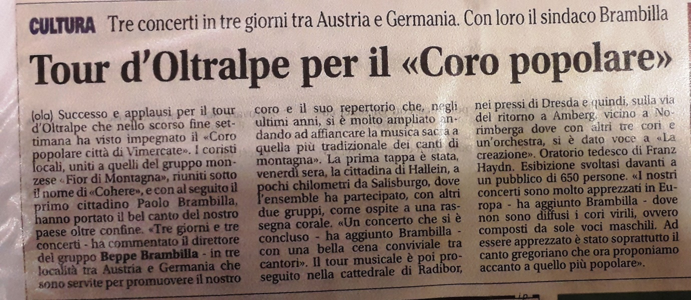
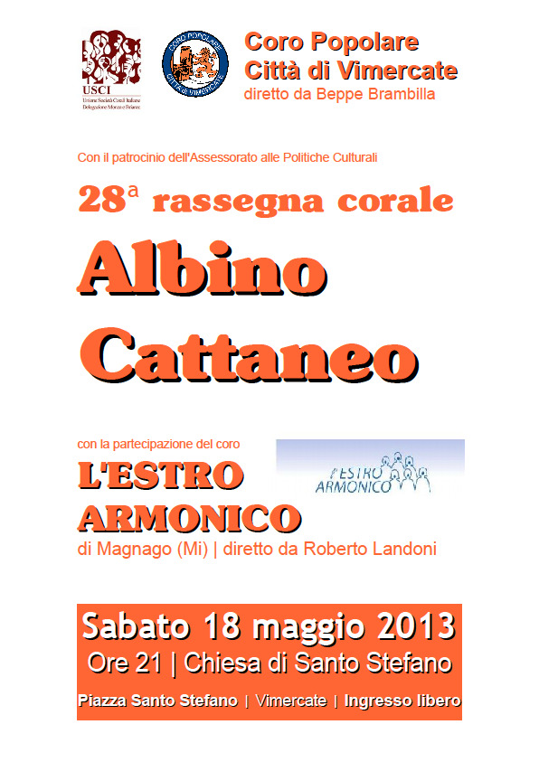

[Archivio eventi passati](..)

# 2013

### 14 dicembre 2013

ore 21,00

Chiesa di Santa Maria Assunta, piazza Unità d'Italia

Il nostro gruppo corale organizza la serata per conto dell'USCI Monza Brianza nell'ambito della rassegna Natalizia "L'Incanto del Natale". Parteciperanno i seguenti cori :

1) Coro ANA Baita di Carate

2) Voci Bianche di Agrate

3) Coro ANA di Giussano

### Sabato 7 dicembre

21,00

Arcore (luogo da definire)

Concerto nell'ambito della Rassegna Natalizia 2013 promossa da USCI MB

### 8-9-10 Novembre

Hallein (Salisburgo Austria), Radibor (Dresda Germania) e Amberg (Norimberga Germania)

Il giorno 8 ore 20,00 concerto ad Hallein

Il giorno 9 ore 20,00 concerto a Radibor

Il giorno 10 ore 16,30 concerto ad Amberg

### Sabato 26 ottobre 2013

21.00

Presso l'Auditorium dell'Istituto Paleocapa di Rovigo via Alcide de Gasperi, 19

Rassegna "Grandi Cori"

### Sabato 07/09/2013

18:00

Chiesa Parrocchiale di Bernareggio

### 27/07/2013 Sabato

21:00

Presso la Chiesa di Bioglio

Canteremo insieme al coro biellese la Campagnola di Mottalciata (biella).

### Sabato 29 GIUGNO

ore 21:00

Piani di Bobbio ( FDM+CDV)

Concerto 150° CAI

### Domenica 23 GIUGNO (Coro Fior di Montagna)

Ore 11:00

Monza presso la Chiesa Artigianelli

Santa Messa

### Giovedì 20 GIUGNO 2013 (Coro Fior di Montagna)

ore 21:00

Teatro Manzoni MONZA

Rassegna S. Giovanni

### Sabato 15 GIUGNO 2013 (Coro Fior di Montagna)

ore 21:00

Vedano

Concerto per ANA ( gruppo alpini)

### 18 Maggio 2013

21.00

Chiesa di Santo Stefano in Vimercate.

28° Rassegna corale "Albino Cattaneo" con la partecipazione del Coro L'Estro Armonico di Magnago.

