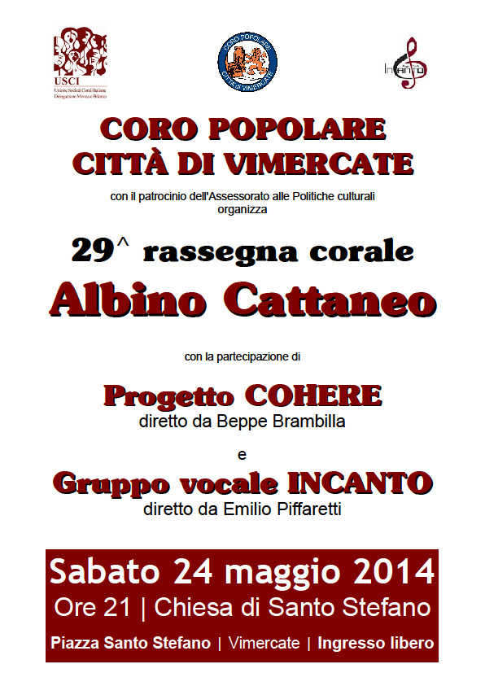

[Archivio eventi passati](..)

# 2014

### 12 Dicembre 2014

21,00

Chiesa di Sulbiate (MB)

### 29 Novembre 2014

21,00

Dolzago (LC)

### 22 Novembre 2014

13,30

Filologico di Milano in via Clericetti

### 8 novembre 2014

21,00

Villasanta teatro Astrolabio, rassegna organizzata dal CAI Villasanta

### 24-25-26-27 ottobre 2014

serali

3 concerti in luoghi diversi a Praga (Rep. Ceca)

### 27 settembre 2014

21.00

Chiesa S. Maria del Carrobiolo a Monza

### 22 giugno 2014

15.45

Casa Famiglia di Olgiate Molgora

Concerto intrattenimento per gli ospiti della casa di riposo su richiesta dell'animatrice sig.ra Marina

### 24 maggio 2014

21.00

Chiesa di Santo Stefano in Vimercate

Rassegna Albino Cattaneo con la presenza del Gruppo Vocale Incanto di Dolzago diretto dal Maestro Emilio Piffaretti docente presso il Conservatorio "G. Verdi" di Milano.

### 26 aprile 2014

21.00

Clusone, teatro locale.

32° rassegna corale organizzata dal Coro Idica di Clusone con la partecipazione del Coro "Vos da Mont" diretto da Marco Maiero e dal Gruppo Cohere diretto da Beppe Brambilla.

### 09 marzo 2014

10.30

Chiesa di Roncello

Accompagnamento della S. Messa + qualche canto finale

### 8 febbraio 2014

17.30

Chiesa parrocchiale di Sulbiate (MB)

Accompagnamento S. Messa.
