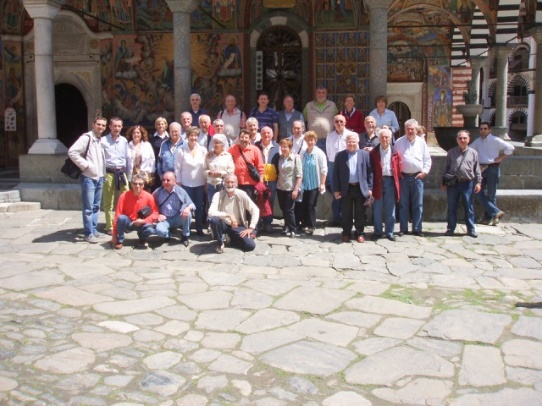

[Archivio eventi passati](..)

# 2007

### 13 ottobre

21.00

Teatro dell’oratorio maschile - Vimercate (MI)

Rassegna d’autunno

### 9 giugno

21.00

22a Rassegna A. Cattaneo ed in contemporanea 35° Anniversario della fondazione del coro

### 4-7 maggio

14.00

Velingrad (Bulgaria)

Rassegna corale

### 10 febbraio

21.00

Pessano con Bornago (MI)

Rassegna corale organizzata dall’USCI

### 14 gennaio

21.00

Santuario della Beata Vergine del Rosario - Vimercate (MI)

Sagra di Sant'Antonio

