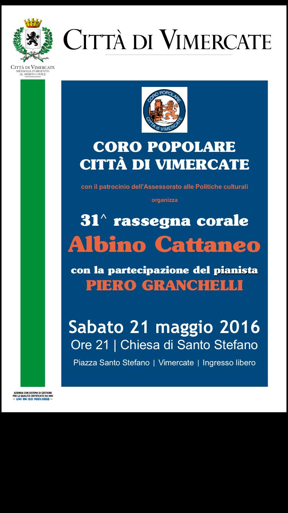
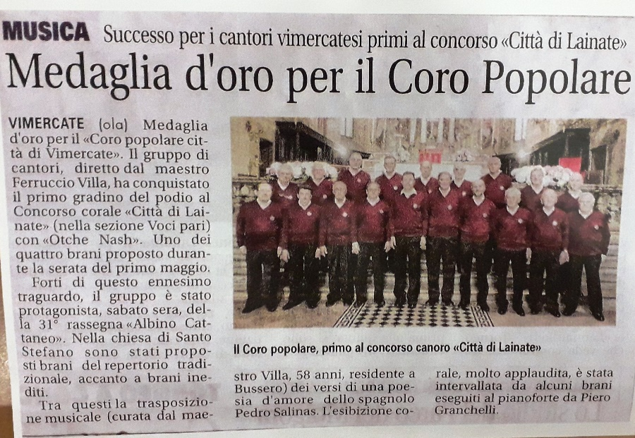

[Archivio eventi passati](..)

# 2016

### 10 Dicembre 2016

21.00

Santuario di Vimercate

Concerto multi corale nell'ambito del Canta Natale promosso dall'USCI Monza Brianza

### 22 Novembre 2016

21.00

Chiesa di Velasca

Ricordando Padre David Maria Turoldo.

### 22 ottobre 2016

21,00

Chiesa parrocchiale di Burago

In occasione di un evento del CAI locale ci è stato chiesto di chiudere la giornata con un concerto del coro che presenterà un programma di brani del proprio repertorio.

### 25 settembre 2016

18,00

Chiesa di San Maurizio

In occasione della festa patronale del rione di San Maurizio ci esibiremo in concerto con brani del nostro repertorio.

### 21 Maggio 2016

21,00

Vimercate - Rassegna Albino Cattaneo presso la chiesa di Santo Stefano.

### 1 Maggio 2016

14.00

1° concorso nazionale di Lainate

### 14 Febbraio 2016

15,00

Olgiate Molgora - concerto presso la casa di riposo in via Aldo Moro.

### 16 Gennaio 2016

20,45

Vimercate - Rassegna corale dei cori vimercatesi presso il Santuario,
