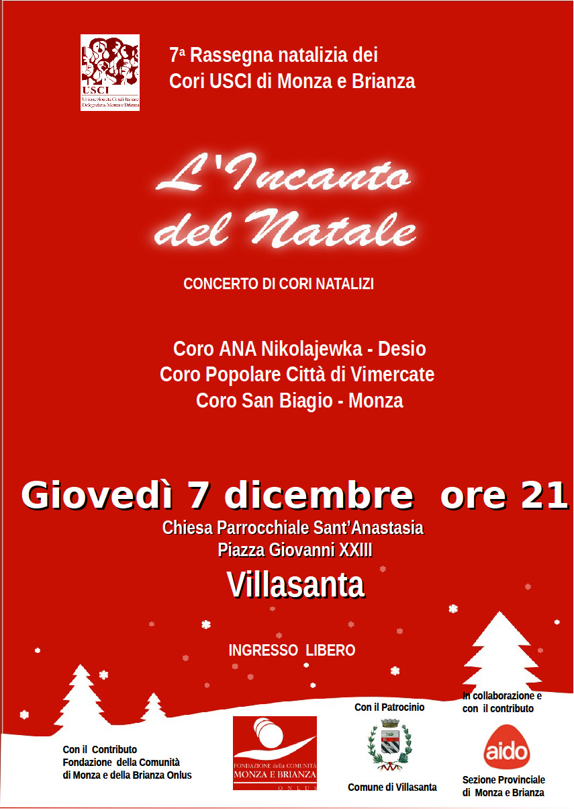
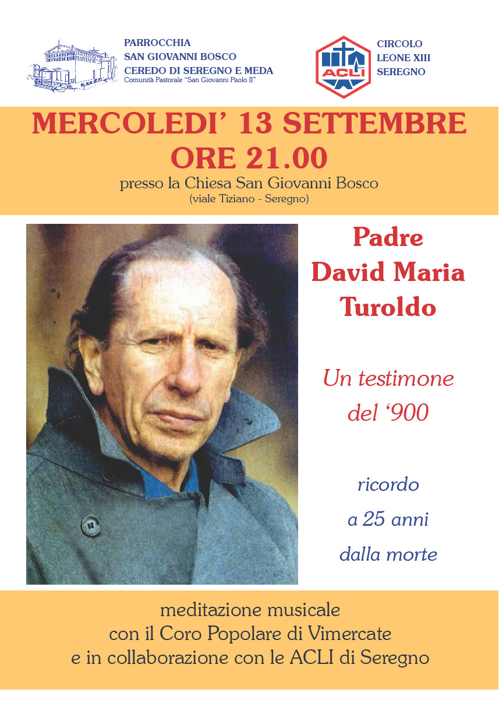
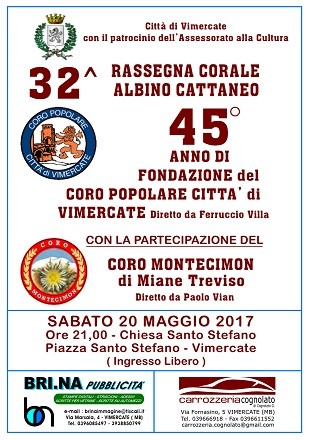
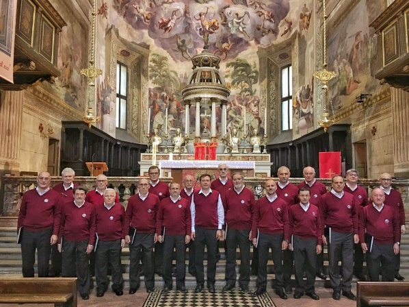
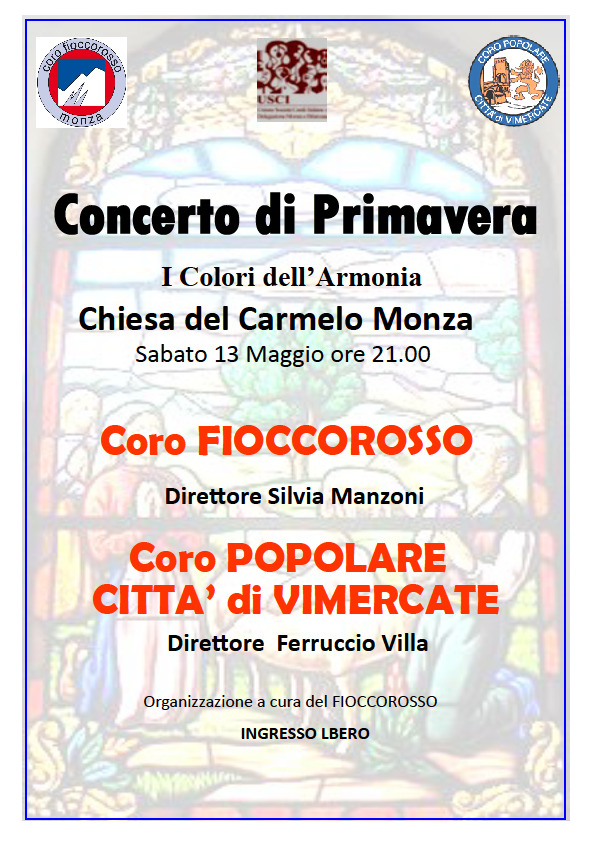

### 7 dicembre 2017

21.00

Chiesa parrocchiale di Villasanta (MB) rassegna organizzata dall'USCI di Monza-Brianza

### 21 ottobre 2017

21.00

Presso la chiesa parrocchiale di Burago di Molgora (MB) serata organizzata dal CAI locale.

### 30 settembre 2017

21.00

Cascina Camuzzago - Bellusco

In ricordo di Padre David Maria Turoldo

### 13 settembre 2017

21.00

Presso la chiesa San Giovanni Bosco a Seregno

In ricordo di Padre David Maria Turoldo

### 7 giugno 2017

21.00

Concerto nell'ambito dell'iniziativa "Cantainchiesa" presso la parrocchia San Pio X di Cinisello Balsamo organizzata dall'associazione nazionale Alpini di Cinisello.

### 20 maggio 2017

21.00

Rassegna "Albino Cattaneo" presso la chiesa di Santo Stefano in Vimercate, coro ospite Montecimon di Miane (TV)

### 13 maggio 2017

21.00

Concerto presso il Santuario del Carmelo a Monza con il coro Fioccorosso

### 7 maggio 2017

10.30

Partecipazione alla Santa Messa presso la chiesa Santa Maria Nascente di Bernate (Arcore)

### 5 Febbraio 2017

21.00

Chiesa parrocchiale di Burago.

In ricordo di Padre David Maria Turoldo

### 15 Gennaio 2017

21.00

Sagra di Sant'Antonio presso il Santuario in Vimercate
