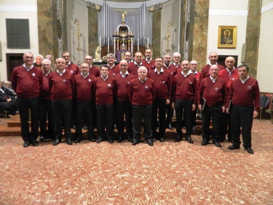
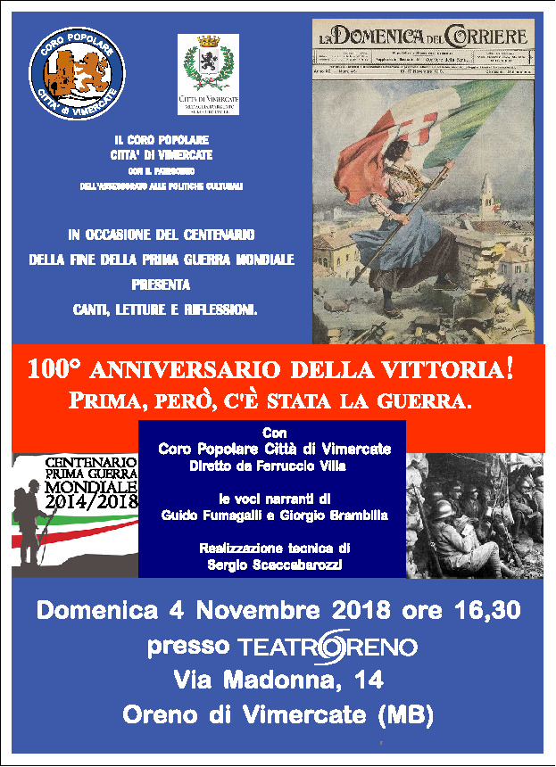
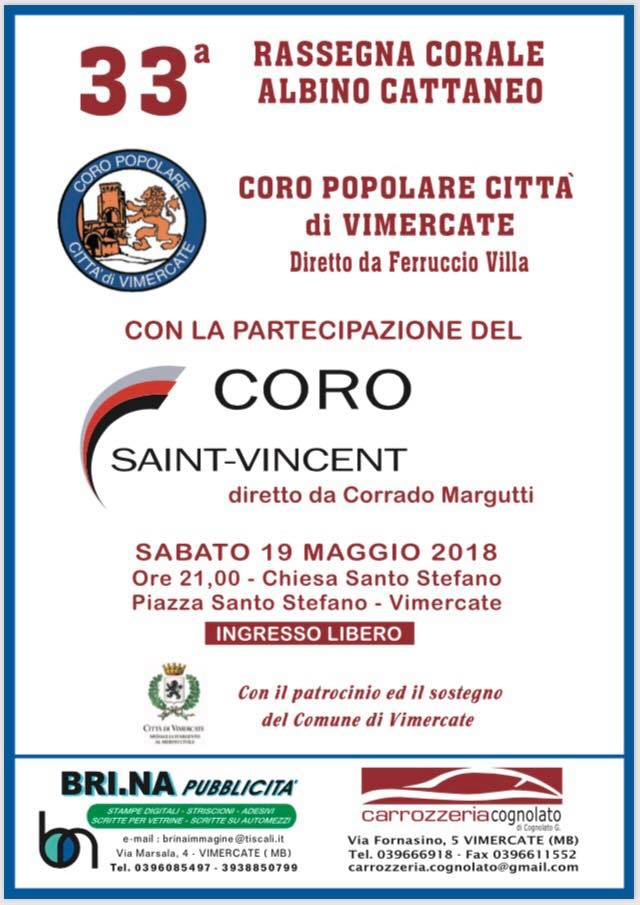

[Archivio eventi passati](./test_markdown)

# 2018

### 02 dicembre 2018

21.00

Chiesa Parrocchiale SS Ambrogio e Vittore Briosco (MB)

Rassegna USCI MB

### 04 novembre 2018

16,00

Teatro di Oreno (Vimercate) Ricorrenza del centenario della fine della Prima Guerra Mondiale

### 27 ottobre 2018

21.00

Burago di Molgora c/o Chiesa Parrocchiale, 12^ rassegna corale organizzata dal CAI

### 20 ottobre 2018

21.00

VOCiNCORO, festa dei crotti c/o Teatro della società operaia Chiavenna

### 13 ottobre 2018

21,00

Rassegna Buraghese organizzata dal CAI

### 01-giugno 2018

21,00

Rassegna a Seriate

### 19 maggio 2018

21,00

Presso la chiesa di Santo Stefano (Vimercate)

Rassegna "Albino Cattaneo" con la partecipazione del Coro Saint-Vincent, direttore Corrado Margutti

### 28 gennaio 2018

11.00

Presso la chiesa di Cinisello Balsamo

Accompagnamento della S. Messa con breve concerto finale

### 13 gennaio 2018

21.00

Presso il Santuario della Beata Vergine in Vimercate

Rassegna dei cori vimercatesi
