# 2019

### 17 dicembre 2019

21,00

Vimercate (MB)

Concerto in tema natalizio presso il santuario della Beata Vergine :

"Avvento un cammino di casa in casa"

con la partecipazione del coro e del maestro Piero Granchelli al pianoforte

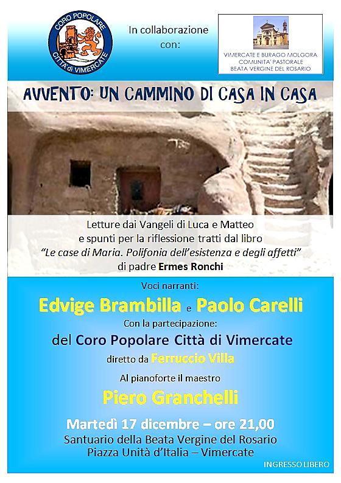

### 14 dicembre 2019

20,45

Vimercate (MB)

Presso il santuario della Beata Vergine organizzato dalla sezione alpini in attesa del Natale

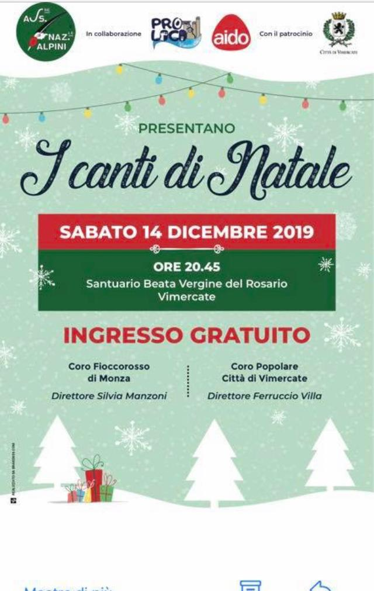

### 23 novembre 2019

21.00

Burago (MB)

Concerto presso la parrocchiale. 13\* rassegna organizzata dal CAI locale con noi ci sarà anche il maestro Granchelli che eseguirà due brani al pianoforte

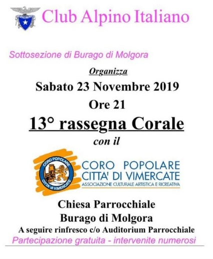

### 26 ottobre 2019

15.30

Centro Culturale Locca di Concei di Ledro - Via di Carpeà, 6, 38067 Locca- TN

Partecipazione al :

TROFEO NAZIONALE CORI D’ITALIA

Concorso e Festival per Cori Maschili Popolari

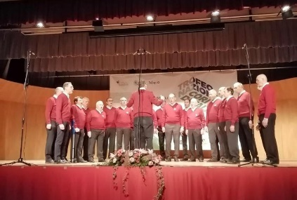

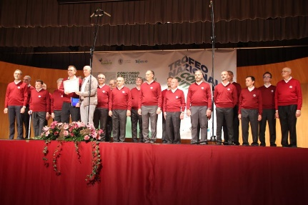

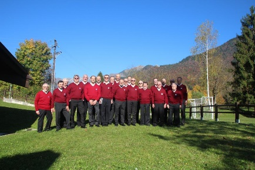

### 28 settembre 2019

21.00

Presso la Chiesa Parrocchiale di Acquate, Lecco

Rassegna "La Valle" organizzate dal Coro Alpino Lecchese con la partecipazione anche della Corale Rilke di Duino (TS)

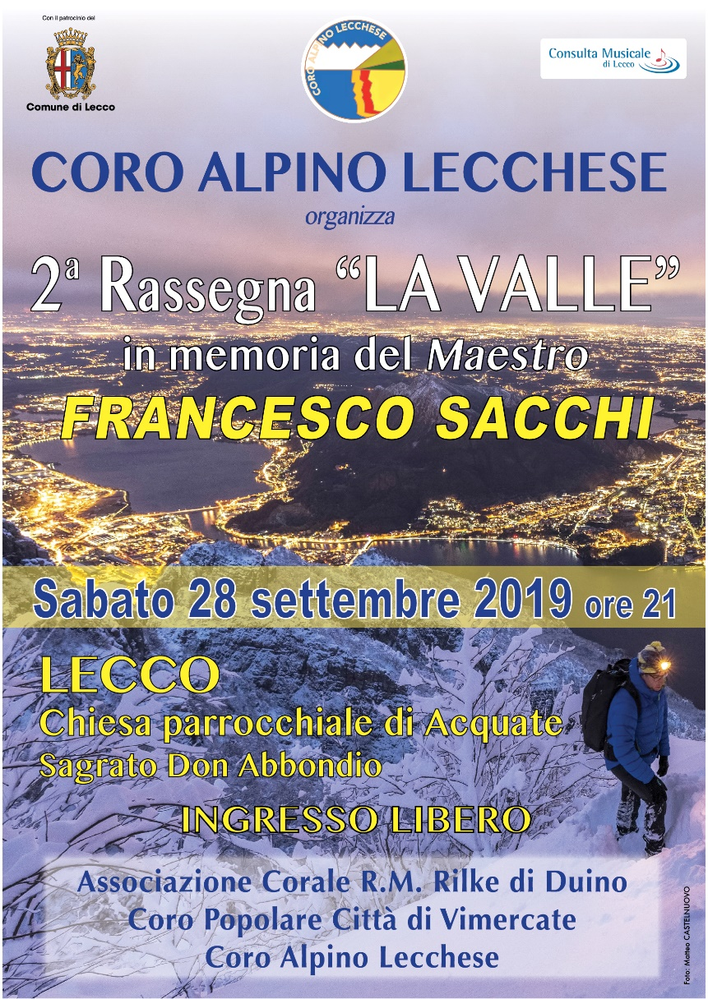

### 25 maggio 2019

21.00

Vimercate, presso la chiesa di Santo Stefano

Rassegna Albino Cattaneo, in questa occasione il nostro coro ospiterà il Coro Nivalis di Chiavenna.

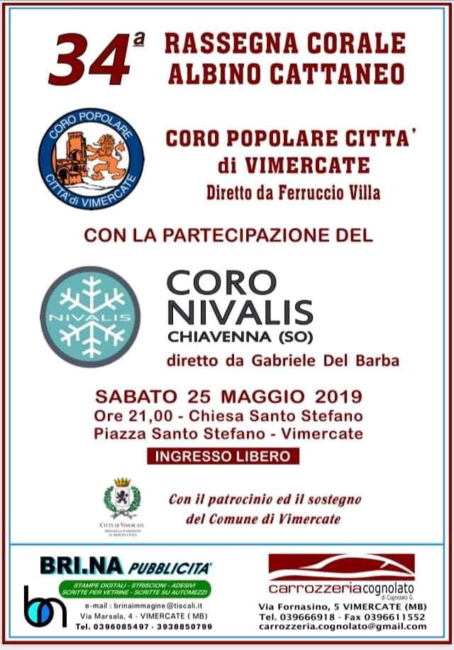

### 13 aprile 2019

21.00

Concerto organizzato dalla Pro Loco a Rivolta d'Adda (CR) presso la Basilica di San Sigismondo

Saremo l'unico coro ad esibirsi presentando un programma misto sacro-profano con due intermezzi che vedranno al piano il maestro Piero Granchelli.

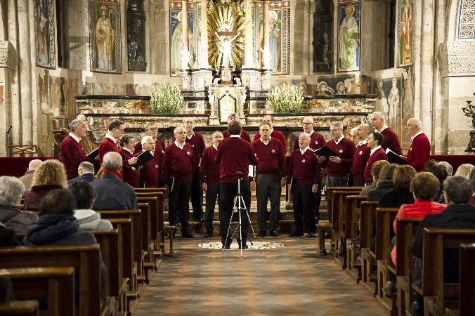

### 17 marzo 2019

17.00

Brescia,chiesa di Santa Maria del Carmine

Rassegna corale con la partecipazione, oltre al nostro coro, del Coro Voci dell'Orobica e del Coro Alte Cime ANA di Brescia

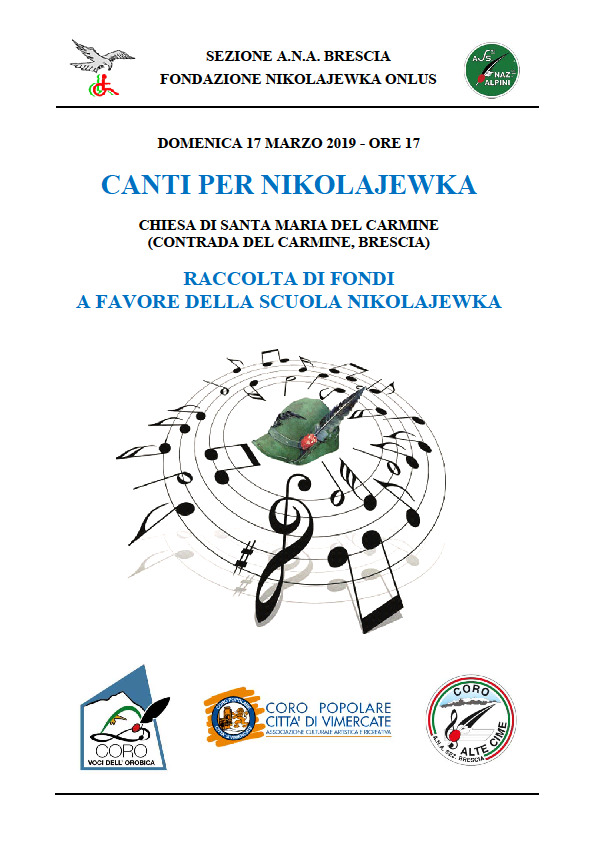

### 16 febbraio 2019

21.00

Sorbolo (PR) presso la chiesa Parrocchiale dei SS. Faustino e Giovita

Rassegna corale con:

Corale Incontro Musicale di Sorbolo

Corale Regina Nivis di Carpi (Modena)

Coro Popolare Città di Vimercate (MB)

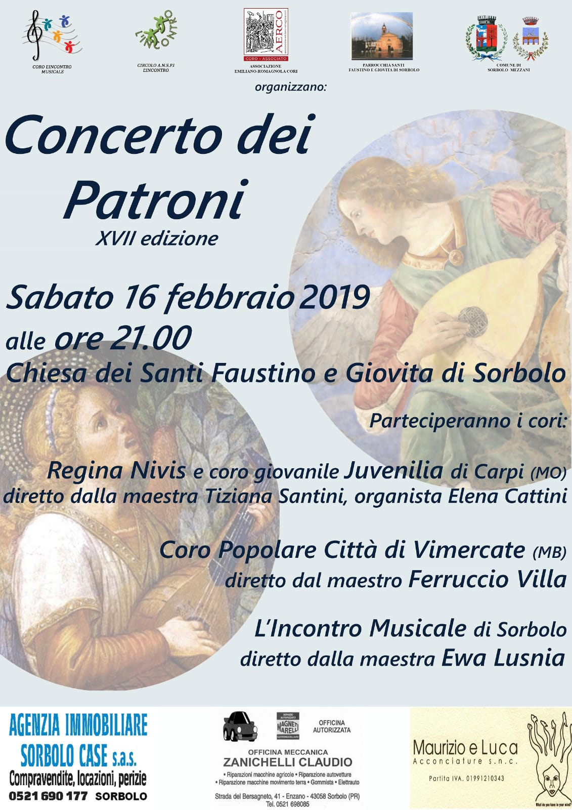

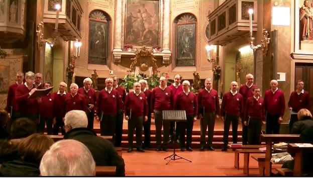

### 26 gennaio 2019

20,45

A Burago, c/o Auditorium. Ricordo del centenario della fine della Prima Guerra Mondiale

### 13 gennaio 2019

20,45

Santuario Beata Vergine a Vimercate.

Rassegna corale per Sant'Antonio.

